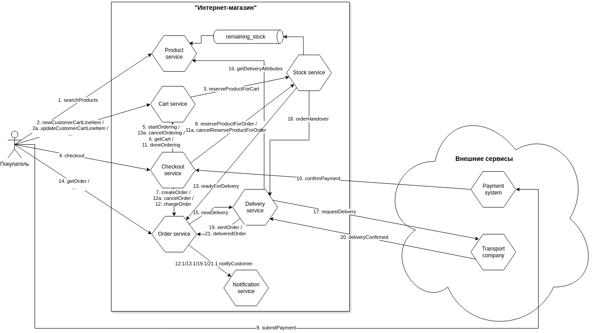

# Паттерны декомпозиции микросервисов

## "Интернет-магазин"

### Пользовательские сценарии

#### Stories:

- Как онлайн покупатель я хочу найти в каталоге подходящий товар
- Как онлайн покупатель я хочу добавить в корзину выбранные товары из числа наличествующих на складе
- Как онлайн покупатель я хочу оформить заказ
- Как онлайн покупатель я хочу посмотреть статус заказа

### Общая схема взаимодействия компонентов

### Описание компонентов

| **Сервис** | **Назначение** | **Отвечает за ...** |
|---|---|---|
| Product service | Управление каталогом товаров | Хранение и получение информации о товаре (название, описание, характеристики, цена) |
| Cart service | Формирование покупательской корзины | Сохранение информации о выбранных покупателем товарах для оформления заказа |
| Checkout Service | Оформление покупки | Прием заказа; получение подтверждения оплаты заказа от платежной системы |
| Order service | Выполнение заказа | Хранение и обработка информации о заказе |
| Stock service | Управление остатками товара на складе | Хранение и получение информации о наличии товаров на складе |
| Notification service | Уведомление покупателей о процессе выполнения заказа | Формирование и доставку сообщений покупателям в процессе обработки заказа |
| Delivery service | Доставка заказа покупателям | Формирование заказа на доставку транспортной компанией; получение информации о стоимости доставки товара транспортной компанией; получение информации о процессе доставки |

### Контракты взаимодействия компонентов

- [Product service REST API](productService.yaml)
