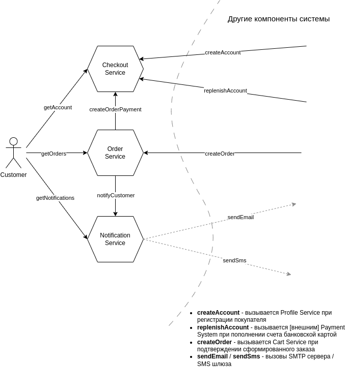

# RESTful API

## Общая схема взаимодействия компонентов



## Сборка и развертывание

### Сборка java приложения, docker образа checkoutservice (в папке checkout-service)

```
./mvnw clean package

docker build --platform linux/amd64 -t checkoutservice:1.0.0 .

docker image tag checkoutservice:1.0.0 gmnvnorlov/ms-arch-tasks-checkoutservice:1.0.0

docker push gmnvnorlov/ms-arch-tasks-checkoutservice:1.0.0
```

### Сборка java приложения, docker образа orderservice (в папке order-service)

```
./mvnw clean package

docker build --platform linux/amd64 -t orderservice:1.0.0 .

docker image tag orderservice:1.0.0 gmnvnorlov/ms-arch-tasks-orderservice:1.0.0

docker push gmnvnorlov/ms-arch-tasks-orderservice:1.0.0
```

### Сборка java приложения, docker образа notificationservice (в папке notification-service)

```
./mvnw clean package

docker build --platform linux/amd64 -t notificationservice:1.0.0 .

docker image tag notificationservice:1.0.0 gmnvnorlov/ms-arch-tasks-notificationservice:1.0.0

docker push gmnvnorlov/ms-arch-tasks-notificationservice:1.0.0
```

### Для запуска приложения в k8s
выполнить команду в папке ./manifests
```
kubectl apply -f . -n=otus
```

## [Postman коллекция](postman)
```
newman run RESTful.postman_collection.json > newman_output.txt
```