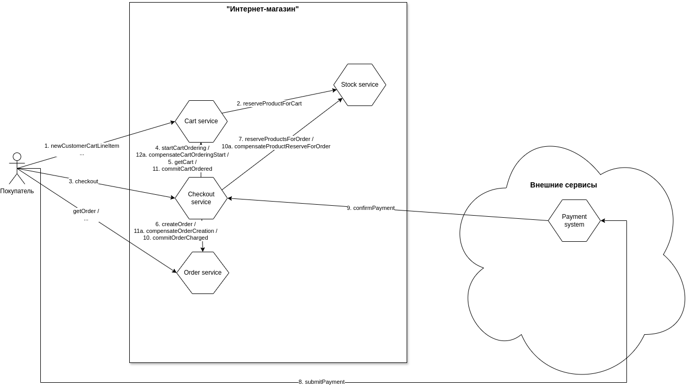

# Идемпотентость API в HTTP

## Общая схема взаимодействия компонентов



### Реализация идемпотентности:
Методы, отмеченные аннотацией @Idempotent, контролируют уникальность запросов с помощью HTTP заголовка 'Idempotency-Key' в формате UUID:
- POST /api/cartservice/public/line-item (newCustomerCartLineItem)
- POST /api/checkoutservice/public/checkout (checkout)
- POST /api/orderservice/private/order (createOrder)
- POST /api/stockservice/private/reserve (reserveProducts)
  
Обработка аннотаций @Idempotent реализована в библиотеке microservice-chassis (в папке chassis-lib).

## Сборка и развертывание

### Сборка библиотеки microservice-chassis (в папке chassis-lib)
```
./mvnw clean install
```

### Сборка java приложения, docker образа checkoutservice (в папке checkout-service)

```
./mvnw clean package

docker build --platform linux/amd64 -t checkoutservice:3.0.1 .

docker image tag checkoutservice:3.0.1 gmnvnorlov/ms-arch-tasks-checkoutservice:3.0.1

docker push gmnvnorlov/ms-arch-tasks-checkoutservice:3.0.1
```

### Сборка java приложения, docker образа orderservice (в папке order-service)

```
./mvnw clean package

docker build --platform linux/amd64 -t orderservice:3.0.0 .

docker image tag orderservice:3.0.0 gmnvnorlov/ms-arch-tasks-orderservice:3.0.0

docker push gmnvnorlov/ms-arch-tasks-orderservice:3.0.0
```

### Сборка java приложения, docker образа cartservice (в папке cartservice-service)

```
./mvnw clean package

docker build --platform linux/amd64 -t cartservice:3.0.0 .

docker image tag cartservice:3.0.0 gmnvnorlov/ms-arch-tasks-cartservice:3.0.0

docker push gmnvnorlov/ms-arch-tasks-cartservice:3.0.0
```

### Сборка java приложения, docker образа stockservice (в папке stockservice-service)

```
./mvnw clean package

docker build --platform linux/amd64 -t stockservice:3.0.0 .

docker image tag stockservice:3.0.0 gmnvnorlov/ms-arch-tasks-stockservice:3.0.0

docker push gmnvnorlov/ms-arch-tasks-stockservice:3.0.0
```

### Для запуска приложения в k8s
выполнить команду в папке ./manifests
```
kubectl apply -f . -n=otus
```

## [Postman коллекция](postman)
```
newman run "SAGA by idempotent API.postman_collection.json" > newman_output.txt
```
